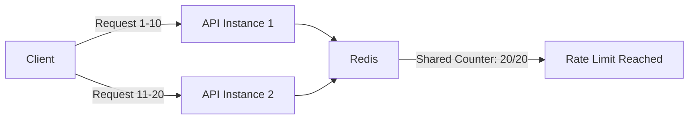

The CryptoPulse API enforces rate limits to ensure fair usage and prevent abuse. Rate limiting is implemented using Redis-backed storage, enabling consistent enforcement across multiple API instances.

## Rate Limit Policies

### Global Rate Limit

Applies to all authenticated endpoints:

- **Limit**: 20 requests per 60 seconds
- **Applies to**:
  - `GET /v1/price/:coinId`
  - `GET /v1/price/:coinId/history`

### Login Rate Limit

Stricter limit for authentication endpoint:

- **Limit**: 5 requests per 60 seconds
- **Applies to**:
  - `POST /auth/login`

### Excluded Endpoints

The following endpoints are **not** rate limited:

- `/docs` - Swagger documentation UI
- `/docs-json` - Swagger OpenAPI JSON specification

## How Rate Limiting Works

### Request Tracking

Rate limits are tracked per user or IP address:

1. **Authenticated requests**: Tracked by user ID from JWT token (`user:<sub>`)
2. **Unauthenticated requests**: Tracked by IP address (`ip:<address>`)

The API extracts the IP address from:
- `req.ip` (primary)
- `X-Forwarded-For` header (for requests behind proxies/load balancers)
- `socket.remoteAddress` (fallback)

### Redis-Backed Storage

Rate limit counters are stored in Redis using the `@nest-lab/throttler-storage-redis` package. This provides:

- **Distributed rate limiting**: Counters are shared across all API instances
- **Automatic expiration**: Counters reset after the TTL window (60 seconds)
- **High performance**: Redis provides fast read/write operations for rate limit checks

<Info>
Redis is required for the API to function. If Redis is unavailable, requests will fail with a `503 Service Unavailable` error.
</Info>

## Configuration

Rate limits are configurable via environment variables:

| Variable | Default | Description |
|----------|---------|-------------|
| `THROTTLE_TTL_MS` | `60000` | Time window in milliseconds (60 seconds) |
| `THROTTLE_GLOBAL_LIMIT` | `20` | Global request limit per window |
| `THROTTLE_LOGIN_LIMIT` | `5` | Login endpoint limit per window |
| `REDIS_URL` | Required | Redis connection string for rate limit storage |

### Example Configuration

```bash
THROTTLE_TTL_MS=60000
THROTTLE_GLOBAL_LIMIT=20
THROTTLE_LOGIN_LIMIT=5
REDIS_URL=redis://localhost:6379
```

## Rate Limit Responses

### When Rate Limit is Exceeded

When you exceed the rate limit, the API returns:

```json
{
  "statusCode": 429,
  "message": "ThrottlerException: Too Many Requests",
  "error": "Too Many Requests"
}
```

### When Rate Limiter is Unavailable

If Redis is unavailable, the API returns:

```json
{
  "statusCode": 503,
  "message": "Rate limiter unavailable",
  "error": "Service Unavailable"
}
```

## Best Practices

### Handling Rate Limits

1. **Implement exponential backoff**: Wait progressively longer between retries
2. **Cache responses**: Store price data locally to reduce API calls
3. **Use batch windows**: The price endpoint batches same-coin requests automatically
4. **Monitor your usage**: Track your request patterns to stay within limits

### Authentication Benefits

Authenticated requests are tracked by user ID, which provides:

- **Consistent limits**: Rate limits follow your user account, not your IP
- **Multi-instance support**: Works correctly behind load balancers or when changing networks
- **Better tracking**: Clear visibility into per-user usage patterns

<Tip>
Always include your JWT token in the `Authorization` header to ensure accurate rate limit tracking.
</Tip>

## Multi-Instance Behavior

When running multiple API instances:

1. All instances share the same Redis storage
2. Rate limit counters are synchronized across instances
3. A request to any instance counts toward your total limit
4. No coordination delay - Redis operations are near-instantaneous

### Example Scenario



## Implementation Details

The rate limiting is implemented using a custom throttler guard (`AppThrottlerGuard`) that:

1. Extends NestJS's `ThrottlerGuard`
2. Extracts JWT tokens from the `Authorization` header
3. Verifies tokens and uses the `sub` claim for user tracking
4. Falls back to IP-based tracking for invalid/missing tokens
5. Excludes documentation endpoints from rate limiting
6. Wraps storage errors in `ServiceUnavailableException`

Source: `src/common/guards/app-throttler.guard.ts`