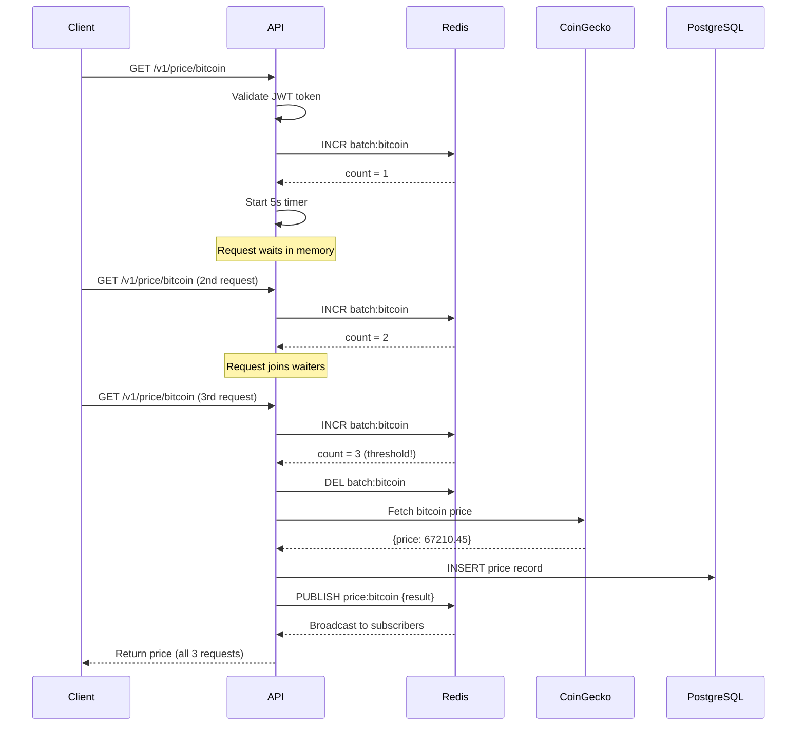

## Overview

CryptoPulse is built on a modern, scalable architecture designed to efficiently handle concurrent cryptocurrency price requests while minimizing external API calls through intelligent batching.

## Tech Stack

The system leverages proven technologies optimized for high-performance API services:

<CardGroup cols={2}>
  <Card title="NestJS + Fastify" icon="node-js">
    Enterprise-grade Node.js framework with high-performance HTTP server
  </Card>
  <Card title="PostgreSQL + TypeORM" icon="database">
    Reliable persistence layer for price history storage
  </Card>
  <Card title="Redis (ioredis)" icon="circle-nodes">
    Distributed coordination for batching and rate limiting
  </Card>
  <Card title="JWT Authentication" icon="lock">
    Secure token-based API access control
  </Card>
</CardGroup>

## System Components

### Application Layer

The application is initialized in `src/main.ts` using NestJS with Fastify adapter:

```typescript src/main.ts
const app = await NestFactory.create<NestFastifyApplication>(
  AppModule,
  new FastifyAdapter(),
  { bufferLogs: true }
);

app.useGlobalPipes(
  new ValidationPipe({
    transform: true,
    whitelist: true,
    forbidNonWhitelisted: true,
  }),
);
```

### Authentication Layer

JWT-based authentication protects all price endpoints. The `JwtAuthGuard` validates bearer tokens on every protected request.

### Service Layer

The `PriceService` orchestrates:
- Request batching coordination via Redis
- External API calls to CoinGecko
- Price persistence to PostgreSQL
- Result distribution to waiting clients

### Data Layer

<Tabs>
  <Tab title="PostgreSQL">
    Stores historical price records with timestamps for trending and analysis.
    
    **Schema**: `PriceRecord` entity tracks `coinId`, `vsCurrency`, `price`, and `fetchedAt`
  </Tab>
  <Tab title="Redis">
    Handles distributed coordination:
    - **Batching counters**: `batch:{coinId}` tracks pending requests
    - **Pub/Sub channels**: `price:{coinId}` broadcasts batch results
    - **Rate limit counters**: Shared across multiple instances
  </Tab>
</Tabs>

## Request Flow

The following diagram illustrates how a price request flows through the system:



### Flow Steps

<Steps>
  <Step title="Request arrives">
    Client sends `GET /v1/price/:coinId` with bearer token
  </Step>
  <Step title="Authentication">
    `JwtAuthGuard` validates the token and extracts user payload
  </Step>
  <Step title="Batch admission">
    Redis counter increments for this `coinId`; request joins in-memory waiters
  </Step>
  <Step title="Timer or threshold">
    Batch flushes when:
    - Counter reaches `BATCH_THRESHOLD` (default: 3), OR
    - Timer expires after `BATCH_WINDOW_MS` (default: 5000ms)
  </Step>
  <Step title="External fetch">
    Single CoinGecko API call retrieves the current price
  </Step>
  <Step title="Persistence">
    Price record saved to PostgreSQL for history queries
  </Step>
  <Step title="Result distribution">
    Redis pub/sub broadcasts result; all waiting requests receive the same response
  </Step>
</Steps>

## Multi-Instance Architecture

CryptoPulse supports horizontal scaling through Redis-based coordination:


**Key features:**
- Shared Redis ensures only ONE batch flush occurs per coin, even across instances
- Rate limiting counters are synchronized
- Each instance maintains its own in-memory waiters but coordinates via pub/sub
- Load balancer (e.g., Nginx) distributes incoming requests

### Configuration for Multi-Instance

```bash
# docker-compose.multi.yml
services:
  nginx:
    image: nginx:alpine
    ports:
      - "3000:80"
  
  api1:
    build: .
    environment:
      - REDIS_URL=redis://redis:6379
      - DATABASE_URL=postgresql://...
  
  api2:
    build: .
    environment:
      - REDIS_URL=redis://redis:6379
      - DATABASE_URL=postgresql://...
```

## Error Handling

The architecture includes comprehensive error handling:

| Scenario | Response |
|----------|----------|
| Redis unavailable during batch admission | `503 Service Unavailable` |
| Batch result timeout (> 8s) | `504 Gateway Timeout` |
| CoinGecko API failure | `502 Bad Gateway` |
| Rate limit exceeded | `429 Too Many Requests` |
| Invalid JWT | `401 Unauthorized` |

<Info>
  All errors are logged with structured JSON for monitoring and debugging.
</Info>

## Performance Characteristics

<AccordionGroup>
  <Accordion title="Batch efficiency">
    With a threshold of 3 and 5-second window, the system reduces external API calls by ~66% under concurrent load.
  </Accordion>
  
  <Accordion title="Response latency">
    - First request in batch: 5s max (window timeout) + CoinGecko latency
    - Subsequent requests: Near-instant once batch flushes
    - Threshold-triggered flush: Minimal delay
  </Accordion>
  
  <Accordion title="Scalability">
    Stateless API instances can scale horizontally. Bottlenecks are:
    - Redis throughput (typically 100k+ ops/sec)
    - PostgreSQL write capacity
    - CoinGecko API rate limits
  </Accordion>
</AccordionGroup>

## Next Steps

<CardGroup cols={2}>
  <Card title="Request Batching" icon="layer-group" href="/concepts/request-batching">
    Deep dive into the batching algorithm
  </Card>
  <Card title="Authentication" icon="shield" href="/concepts/authentication">
    Learn how JWT auth secures endpoints
  </Card>
</CardGroup>
