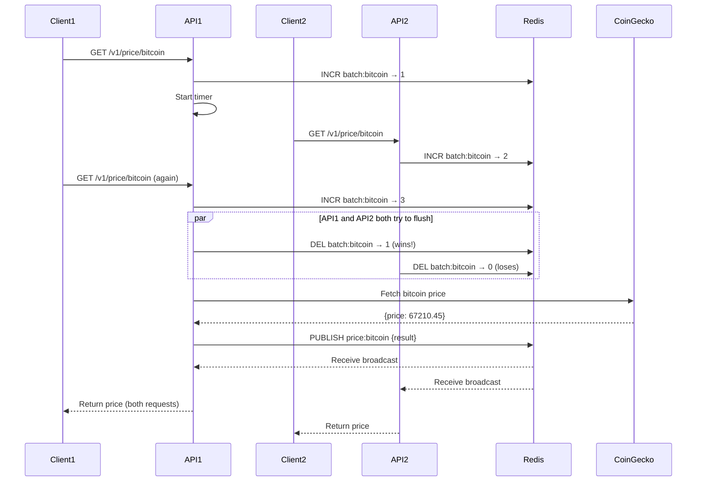

## Overview

Request batching is the core optimization in CryptoPulse. When multiple clients request the same cryptocurrency price simultaneously, the system groups them together and makes a single external API call, dramatically reducing costs and respecting rate limits.

## Why Batching?

<CardGroup cols={2}>
  <Card title="Cost Reduction" icon="dollar-sign">
    One CoinGecko API call serves 3+ requests, reducing API consumption by 66%+
  </Card>
  <Card title="Rate Limit Compliance" icon="gauge-high">
    Fewer calls = less risk of hitting provider limits
  </Card>
  <Card title="Consistent Data" icon="check">
    All requests in a batch get the exact same price snapshot
  </Card>
  <Card title="Scalable" icon="arrows-up-down">
    Works across multiple instances via Redis coordination
  </Card>
</CardGroup>

## Batching Parameters

Two configurable parameters control batch behavior:

### Batch Window (Default: 5 seconds)

The maximum time to wait for more requests before flushing the batch.

```bash
BATCH_WINDOW_MS=5000  # 5 seconds
```

**How it works:**
- First request for a coin starts a timer
- Timer is stored in memory per coin
- When timer expires, batch flushes immediately

### Batch Threshold (Default: 3 requests)

The number of pending requests that triggers an immediate flush, overriding the timer.

```bash
BATCH_THRESHOLD=3  # Flush after 3 requests
```

**How it works:**
- Redis counter tracks pending requests per coin
- When counter reaches threshold, batch flushes early
- Prevents unnecessary waiting when threshold is met

<Tip>
  **Tuning advice:** 
  - Lower threshold = faster response, more API calls
  - Higher threshold = better batching, longer wait times
  - Adjust based on your traffic patterns and API budget
</Tip>

## Implementation Details

The batching logic is implemented in `src/price/price.service.ts`.

### Core Data Structures

```typescript src/price/price.service.ts
private readonly waiters = new Map<string, AppTypes.PriceWaiter[]>();
private readonly timers = new Map<string, NodeJS.Timeout>();

private readonly batchWindowMs: number;
private readonly batchThreshold: number;

constructor(
  private readonly configService: ConfigService,
  @Inject(REDIS_PUBLISHER) private readonly publisher: Redis,
  @Inject(REDIS_SUBSCRIBER) private readonly subscriber: Redis,
) {
  this.batchWindowMs = this.configService.get<number>('BATCH_WINDOW_MS') ?? 5000;
  this.batchThreshold = this.configService.get<number>('BATCH_THRESHOLD') ?? 3;
}
```

**Key structures:**
- `waiters`: In-memory map of pending requests per coin (each has a promise/reject pair)
- `timers`: Per-coin timeout handles for window expiration
- Redis counters: Distributed coordination across instances

### Request Flow

<Steps>
  <Step title="Request arrives">
    Client calls `getCurrentPrice('bitcoin')`
  </Step>
  
  <Step title="Add to waiters">
    ```typescript
    const { promise, waiter } = this.addWaiter(coinId);
    ```
    Creates a promise that will resolve when batch flushes
  </Step>
  
  <Step title="Increment Redis counter">
    ```typescript
    const batchKey = `batch:${coinId}`;
    count = await this.publisher.incr(batchKey);
    
    if (count === 1) {
      // First request - set expiration for cleanup
      await this.publisher.pexpire(batchKey, this.batchWindowMs + 2000);
    }
    ```
    Atomically increments the batch counter in Redis
  </Step>
  
  <Step title="Start timer (first request only)">
    ```typescript
    if (!this.timers.has(coinId)) {
      const timer = setTimeout(() => {
        this.timers.delete(coinId);
        void this.attemptFlush(coinId);
      }, this.batchWindowMs);
      this.timers.set(coinId, timer);
    }
    ```
    Only the first request starts the window timer
  </Step>
  
  <Step title="Check threshold">
    ```typescript
    if (count >= this.batchThreshold) {
      void this.attemptFlush(coinId);
    }
    ```
    If threshold reached, trigger immediate flush
  </Step>
  
  <Step title="Wait for result">
    Request suspends and waits for the batch to flush
  </Step>
</Steps>

### Flushing the Batch

When a batch flushes (via timer or threshold), `attemptFlush` executes:

```typescript src/price/price.service.ts
private async attemptFlush(coinId: string): Promise<void> {
  // Atomic delete - only ONE instance wins
  const deleted = await this.publisher.del(`batch:${coinId}`);
  
  if (deleted === 0) {
    return; // Another instance already flushing
  }
  
  // Clear the timer
  const timer = this.timers.get(coinId);
  if (timer) {
    clearTimeout(timer);
    this.timers.delete(coinId);
  }
  
  try {
    // Single external API call
    const result = await this.coinGeckoService.fetchCurrentPrice(coinId);
    
    // Persist to database
    await this.priceRecordRepository.insert({
      coinId: result.coinId,
      vsCurrency: result.vsCurrency,
      price: result.price,
      fetchedAt: new Date(result.fetchedAt),
    });
    
    // Broadcast success to all instances
    const payload: AppTypes.PriceBatchResult = {
      ok: true,
      coinId: result.coinId,
      vsCurrency: result.vsCurrency,
      price: result.price,
      fetchedAt: result.fetchedAt,
    };
    
    await this.publisher.publish(`price:${coinId}`, JSON.stringify(payload));
  } catch (error) {
    // Broadcast failure to all instances
    const payload: AppTypes.PriceBatchResult = {
      ok: false,
      message: httpError.message,
      statusCode: httpError.getStatus(),
    };
    
    await this.publisher.publish(`price:${coinId}`, JSON.stringify(payload));
  }
}
```

<Note>
  The `del` operation is atomic. If multiple instances try to flush simultaneously, only one succeeds (returns `1`), preventing duplicate API calls.
</Note>

### Settling Waiters

When a batch result is published, all subscribed instances receive it:

```typescript src/price/price.service.ts
async onModuleInit() {
  await this.subscriber.psubscribe('price:*');
  
  this.subscriber.on('pmessage', (_pattern, channel, message) => {
    const coinId = channel.slice('price:'.length);
    this.settleWaiters(coinId, JSON.parse(message));
  });
}

private settleWaiters(coinId: string, result: AppTypes.PriceBatchResult): void {
  const coinWaiters = this.waiters.get(coinId);
  if (!coinWaiters || coinWaiters.length === 0) return;
  
  this.waiters.delete(coinId);
  
  for (const w of coinWaiters) {
    clearTimeout(w.timeout);
    
    if (result.ok) {
      w.resolve({
        coinId: result.coinId,
        vsCurrency: result.vsCurrency,
        price: result.price,
        fetchedAt: result.fetchedAt,
      });
    } else {
      w.reject(new HttpException(result.message, result.statusCode));
    }
  }
}
```

All waiting requests resolve or reject based on the batch result.

## Redis Coordination

### Key Patterns

<Tabs>
  <Tab title="Batch Counters">
    ```
    batch:bitcoin → counter (expires after BATCH_WINDOW_MS + 2s)
    batch:ethereum → counter
    batch:cardano → counter
    ```
    
    Each coin has its own counter. The first request sets an expiration for cleanup.
  </Tab>
  
  <Tab title="Pub/Sub Channels">
    ```
    price:bitcoin → {ok: true, price: 67210.45, ...}
    price:ethereum → {ok: true, price: 3450.12, ...}
    price:cardano → {ok: false, message: "Not found", statusCode: 404}
    ```
    
    Results are published to coin-specific channels. All instances subscribe via pattern `price:*`.
  </Tab>
</Tabs>

### Multi-Instance Synchronization



<Info>
  Redis ensures that even with multiple instances, only **one** external API call occurs per batch.
</Info>

## Request Timeout

Each request has an individual timeout to prevent indefinite waiting:

```typescript src/price/price.service.ts
private readonly requestTimeoutMs: number;

constructor() {
  this.requestTimeoutMs = this.configService.get<number>('REQUEST_TIMEOUT_MS') ?? 8000;
}

private addWaiter(coinId: string): AppTypes.PriceWaiterRegistration {
  const promise = new Promise<PriceResponseDto>((resolve, reject) => {
    waiter = {
      resolve,
      reject,
      timeout: setTimeout(() => {
        this.removeWaiter(coinId, waiter);
        reject(new GatewayTimeoutException('Timed out waiting for batch result'));
      }, this.requestTimeoutMs),
    };
  });
  
  return { promise, waiter };
}
```

**Default: 8 seconds** (must exceed `BATCH_WINDOW_MS` + external API latency)

## Error Handling

### Redis Unavailable

If Redis is down during batch admission:

```typescript
try {
  count = await this.publisher.incr(batchKey);
} catch (error) {
  clearTimeout(waiter.timeout);
  this.removeWaiter(coinId, waiter);
  throw new ServiceUnavailableException('Batch coordination unavailable');
}
```

Client receives `503 Service Unavailable`.

### External API Failure

If CoinGecko fails, all waiters receive the same error:

```typescript
try {
  const result = await this.coinGeckoService.fetchCurrentPrice(coinId);
  // ... success path
} catch (error) {
  const payload: AppTypes.PriceBatchResult = {
    ok: false,
    message: httpError.message,
    statusCode: httpError.getStatus(), // 404, 429, 502, etc.
  };
  
  await this.publisher.publish(`price:${coinId}`, JSON.stringify(payload));
}
```

### Service Shutdown

On module destroy, all pending requests are rejected:

```typescript
onModuleDestroy(): void {
  for (const [coinId, coinWaiters] of this.waiters.entries()) {
    const error = new GatewayTimeoutException(
      `Service shutting down before processing ${coinId}`,
    );
    for (const w of coinWaiters) {
      clearTimeout(w.timeout);
      w.reject(error);
    }
  }
  this.waiters.clear();
  this.timers.clear();
}
```

## Testing Batching

You can test batching behavior with concurrent requests:

```bash
# Make 5 concurrent requests for bitcoin
for i in {1..5}; do
  curl -H "Authorization: Bearer $TOKEN" \
    http://localhost:3000/v1/price/bitcoin &
done
wait
```

Check logs for batch events:

```json
{"event":"batch_join","coinId":"bitcoin","count":1}
{"event":"batch_join","coinId":"bitcoin","count":2}
{"event":"batch_join","coinId":"bitcoin","count":3}
{"event":"batch_flushed","coinId":"bitcoin","price":67210.45}
```

<Check>
  All 5 requests are served by a single CoinGecko API call!
</Check>

## Best Practices

<AccordionGroup>
  <Accordion title="Configure for your traffic">
    - **High traffic (100+ req/min)**: Lower threshold (2-3), shorter window (2-3s)
    - **Low traffic (less than 10 req/min)**: Higher threshold (5+), longer window (10s)
    - **Cost-sensitive**: Maximize threshold and window
    - **Latency-sensitive**: Minimize threshold and window
  </Accordion>
  
  <Accordion title="Monitor batch efficiency">
    Calculate your batching ratio:
    ```
    efficiency = 1 - (external_api_calls / total_requests)
    ```
    
    Target >50% for cost savings.
  </Accordion>
  
  <Accordion title="Handle Redis failures">
    - Use Redis sentinel or cluster for high availability
    - Implement circuit breaker if Redis is frequently unavailable
    - Consider fallback to direct API calls (without batching) if Redis is down
  </Accordion>
</AccordionGroup>

## Next Steps

<CardGroup cols={2}>
  <Card title="System Architecture" icon="sitemap" href="/concepts/architecture">
    See how batching fits into the overall system
  </Card>
  <Card title="API Reference" icon="code" href="/api/endpoints/get-price">
    View the price endpoint documentation
  </Card>
</CardGroup>
